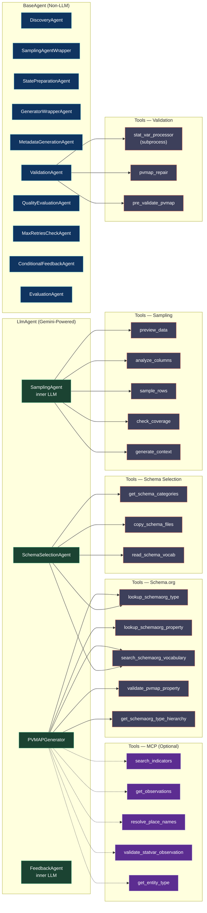
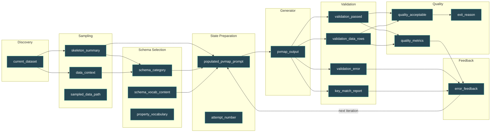

# Pipeline Workflow Diagram

## Comprehensive PVMAP Generation Pipeline

```mermaid
flowchart TB
    %% =========================================================================
    %% STYLING
    %% =========================================================================
    classDef entrypoint fill:#1a1a2e,stroke:#e94560,color:#fff,stroke-width:3px
    classDef phase fill:#16213e,stroke:#0f3460,color:#fff,stroke-width:2px
    classDef agent fill:#0f3460,stroke:#53a8b6,color:#fff,stroke-width:2px
    classDef llmagent fill:#1b4332,stroke:#52b788,color:#fff,stroke-width:2px
    classDef tool fill:#3d405b,stroke:#e07a5f,color:#fff,stroke-width:1px
    classDef mcp fill:#5c2d91,stroke:#b4a7d6,color:#fff,stroke-width:2px
    classDef decision fill:#6b2737,stroke:#e07a5f,color:#fff,stroke-width:2px
    classDef state fill:#264653,stroke:#2a9d8f,color:#fff,stroke-width:1px
    classDef success fill:#1b4332,stroke:#40916c,color:#fff,stroke-width:3px
    classDef fail fill:#6b2737,stroke:#e07a5f,color:#fff,stroke-width:3px
    classDef loop fill:#2d2d44,stroke:#ffd166,color:#fff,stroke-width:3px,stroke-dasharray: 5 5

    %% =========================================================================
    %% ENTRY POINT
    %% =========================================================================
    START([run_pipeline.py __main__]):::entrypoint
    START --> ARGPARSE[Parse CLI Arguments<br/>--dataset, --model, --enable-mcp<br/>--skip-sampling, --skip-evaluation<br/>--thinking-level, --prompt-version]

    ARGPARSE --> INPUT_MODE{Input Mode?}:::decision
    INPUT_MODE -->|--input-file| STANDALONE[Standalone Mode<br/>derive_dataset_name]
    INPUT_MODE -->|--dataset| NAMED[Named Dataset]
    INPUT_MODE -->|neither| AUTO_DISCOVER[Auto Discovery<br/>run_discovery]

    STANDALONE --> PIPELINE_ENTRY
    NAMED --> PIPELINE_ENTRY
    AUTO_DISCOVER --> PIPELINE_ENTRY

    %% =========================================================================
    %% MCP SERVER STARTUP
    %% =========================================================================
    ARGPARSE --> MCP_CHECK{--enable-mcp?}:::decision
    MCP_CHECK -->|Yes| MCP_START[MCPServerManager.start<br/>port 3000, timeout 30s]:::mcp
    MCP_START --> MCP_URL[mcp_url ready]:::mcp
    MCP_CHECK -->|No| NO_MCP[MCP disabled]

    MCP_URL --> PIPELINE_ENTRY
    NO_MCP --> PIPELINE_ENTRY

    %% =========================================================================
    %% run_dataset_pipeline()
    %% =========================================================================
    PIPELINE_ENTRY[run_dataset_pipeline]:::entrypoint

    subgraph SETUP ["Pipeline Setup"]
        direction TB
        SETUP_LOG[setup_python_logging<br/>per-dataset log file]
        SETUP_SAMPLING[Create SamplingAgentWrapper<br/>model from SAMPLING_AGENT_MODEL env]
        SETUP_SCHEMA[Create SchemaSelectionAgent<br/>if not --skip-schema-selection]
        SETUP_PVMAP[create_pvmap_retry_loop<br/>LoopAgent with max_retries+1 iterations]
        SETUP_EVAL[Create EvaluationAgent]
        SETUP_SEQ[SequentialAgent<br/>GenerationAndEvaluation]
        SETUP_RUNNER[create_runner<br/>ADK Runner + plugins]

        SETUP_LOG --> SETUP_SAMPLING --> SETUP_SCHEMA --> SETUP_PVMAP --> SETUP_EVAL --> SETUP_SEQ --> SETUP_RUNNER
    end
    PIPELINE_ENTRY --> SETUP

    subgraph DISCOVER ["Phase 1: Discovery"]
        direction TB
        DISC_AGENT[DiscoveryAgent<br/>BaseAgent]:::agent
        DISC_SINGLE[_discover_single_dataset<br/>or _discover_standalone]:::tool
        DISC_FILES["Discovers:<br/>• input_data files<br/>• metadata files<br/>• schema files<br/>• sampled_data files<br/>• ground truth"]:::state

        DISC_AGENT --> DISC_SINGLE --> DISC_FILES
    end
    SETUP --> DISCOVER

    DISCOVER --> INIT_STATE["Initialize Session State<br/>━━━━━━━━━━━━━━━━━━━━━<br/>current_dataset: DatasetInfo<br/>model, dataset_name<br/>skip_sampling, force_resample<br/>skip_schema_selection<br/>ground_truth_pvmap/dir/repo<br/>use_metadata, prompt_version<br/>schema_base_dir<br/>+ human_feedback if provided"]:::state

    INIT_STATE --> RUN_ASYNC

    %% =========================================================================
    %% ASYNC EXECUTION
    %% =========================================================================
    RUN_ASYNC["_create_session_and_run<br/>asyncio event loop<br/>pipeline_timeout = (max_retries+1) × 900s"]

    RUN_ASYNC --> HEARTBEAT["Heartbeat Task<br/>logs every 120s"]
    RUN_ASYNC --> EVENT_STREAM["runner.run_async<br/>consume events with 300s stall timeout"]

    EVENT_STREAM --> SEQ_AGENT

    %% =========================================================================
    %% SEQUENTIAL AGENT (TOP-LEVEL)
    %% =========================================================================
    subgraph SEQ_AGENT ["SequentialAgent: GenerationAndEvaluation"]
        direction TB

        %% ==================================================================
        %% PHASE 2: SAMPLING
        %% ==================================================================
        subgraph PHASE2 ["Phase 2: Data Sampling"]
            direction TB
            SAMP_WRAP[SamplingAgentWrapper<br/>BaseAgent wrapper]:::agent
            SAMP_SKIP{skip_sampling<br/>or cache exists?}:::decision
            SAMP_LLM["Inner LlmAgent<br/>(fresh per invocation)"]:::llmagent

            SAMP_WRAP --> SAMP_SKIP
            SAMP_SKIP -->|Yes| SAMP_CACHED[Use cached<br/>sampled data]
            SAMP_SKIP -->|No| SAMP_LLM

            subgraph SAMP_TOOLS ["Sampling Tools"]
                direction LR
                ST1[preview_data]:::tool
                ST2[analyze_columns]:::tool
                ST3[sample_rows]:::tool
                ST4[check_coverage]:::tool
                ST5[generate_context]:::tool
            end
            SAMP_LLM --> SAMP_TOOLS

            SAMP_OUT["State Output:<br/>skeleton_summary<br/>data_context<br/>sampled_data_path"]:::state
            SAMP_TOOLS --> SAMP_OUT
            SAMP_CACHED --> SAMP_OUT
        end

        %% ==================================================================
        %% PHASE 2.5: SCHEMA SELECTION
        %% ==================================================================
        subgraph PHASE25 ["Phase 2.5: Schema Selection (optional)"]
            direction TB
            SCHEMA_AGENT["SchemaSelectionAgent<br/>LlmAgent"]:::llmagent

            subgraph SCHEMA_TOOLS ["Schema Tools"]
                direction LR
                SCT1[get_schema_categories]:::tool
                SCT2[copy_schema_files]:::tool
                SCT3[read_schema_vocab]:::tool
                SCT4["search_schemaorg_vocabulary<br/>(Schema.org)"]:::tool
                SCT5["lookup_schemaorg_type<br/>(Schema.org)"]:::tool
            end
            SCHEMA_AGENT --> SCHEMA_TOOLS

            SCHEMA_OUT["State Output:<br/>schema_category<br/>schema_vocab_content<br/>property_vocabulary"]:::state
            SCHEMA_TOOLS --> SCHEMA_OUT
        end

        PHASE2 --> PHASE25

        %% ==================================================================
        %% PHASE 3: PVMAP RETRY LOOP
        %% ==================================================================
        subgraph RETRY_LOOP ["Phase 3: LoopAgent — PVMAPRetryLoop"]
            direction TB
            style RETRY_LOOP fill:#1a1a2e,stroke:#ffd166,color:#fff,stroke-width:3px

            %% --- 1. State Preparation ---
            subgraph STATE_PREP ["Step 1: StatePreparationAgent"]
                direction TB
                SP_AGENT[StatePreparationAgent<br/>BaseAgent]:::agent
                SP_ACTIONS["• Increment attempt_number<br/>• Init tracking on attempt 0<br/>• Cache ground truth path<br/>• Read schema/sampled/metadata files<br/>• Populate prompt template<br/>  (improved_pvmap_prompt.txt)<br/>• Replace placeholders:<br/>  SCHEMA_EXAMPLES, SAMPLED_DATA,<br/>  METADATA_CONFIG, SKELETON_SUMMARY,<br/>  ERROR_FEEDBACK<br/>• Cache property_vocabulary"]:::state
                SP_AGENT --> SP_ACTIONS
            end

            %% --- 2. StatVar Discovery (MCP) ---
            subgraph STATVAR_DISC ["Step 2: StatVarDiscovery (MCP only)"]
                direction TB
                SV_AGENT["StatVarDiscoveryAgent<br/>BaseAgent"]:::mcp
                SV_MCP["DC MCP Tools:<br/>search_indicators<br/>get_observations"]:::mcp
                SV_OUT["State Output:<br/>statvar_summary<br/>mcp_enrichment_context"]:::state
                SV_AGENT --> SV_MCP --> SV_OUT
            end

            %% --- 3. PVMAP Generator ---
            subgraph GENERATOR ["Step 3: PVMAPGeneratorAgent"]
                direction TB
                GEN_WRAP["GeneratorWrapperAgent<br/>BaseAgent"]:::agent
                GEN_LLM["Inner PVMAPGenerator<br/>LlmAgent<br/>output_schema=PVMAPOutput"]:::llmagent
                GEN_WRAP --> GEN_LLM

                subgraph GEN_TOOLS ["Generator Tools"]
                    direction LR
                    GT1["lookup_schemaorg_type"]:::tool
                    GT2["lookup_schemaorg_property"]:::tool
                    GT3["search_schemaorg_vocabulary"]:::tool
                    GT4["validate_pvmap_property"]:::tool
                    GT5["get_schemaorg_type_hierarchy"]:::tool
                end
                GEN_LLM --> GEN_TOOLS

                subgraph MCP_TOOLS_GEN ["MCP Tools (if enabled)"]
                    direction LR
                    MT1["resolve_place_names"]:::mcp
                    MT2["validate_statvar_observation"]:::mcp
                    MT3["get_entity_type"]:::mcp
                    MT4["DC MCP Toolset<br/>search_indicators<br/>get_observations"]:::mcp
                end
                GEN_LLM -.->|MCP enabled| MCP_TOOLS_GEN

                GEN_OUT["State Output:<br/>pvmap_output (JSON)<br/>pvmap_llm_result"]:::state
                GEN_TOOLS --> GEN_OUT
                MCP_TOOLS_GEN -.-> GEN_OUT
            end

            %% --- 4. Metadata Generation ---
            subgraph META_GEN ["Step 4: MetadataGenerationAgent"]
                direction TB
                META_AGENT["MetadataGenerationAgent<br/>BaseAgent"]:::agent
                META_ACTION["Auto-generate<br/>stat_var_processor config<br/>(output_metadata.csv)"]:::tool
                META_AGENT --> META_ACTION
            end

            %% --- 5. MCP Spot Check ---
            subgraph SPOT_CHECK ["Step 5: MCPSpotCheck (MCP only)"]
                direction TB
                SC_AGENT["MCPSpotCheckAgent<br/>BaseAgent"]:::mcp
                SC_ACTION["Quick pre-validation<br/>against DC data"]:::mcp
                SC_AGENT --> SC_ACTION
            end

            %% --- 6. Validation ---
            subgraph VALIDATION ["Step 6: ValidationAgent"]
                direction TB
                VAL_AGENT[ValidationAgent<br/>BaseAgent]:::agent
                VAL_STEPS["1. Parse pvmap_output → PVMAPOutput<br/>2. Convert JSON → CSV deterministically<br/>3. PVMAP Repair (pvmap_repair.py):<br/>   • Key fuzzy matching (0.80-0.85)<br/>   • Case/whitespace normalization<br/>   • Placeholder fix: [DATA]→{Data}<br/>   • Hallucination cleanup<br/>4. Pre-validate structure<br/>   (skip subprocess if structural fail)<br/>5. Run stat_var_processor subprocess<br/>   on FULL dataset (timeout: 300s)<br/>6. Generate key_match_report<br/>7. Track best attempt"]:::state
                VAL_AGENT --> VAL_STEPS

                VAL_OUT["State Output:<br/>validation_passed: bool<br/>validation_error: str<br/>validation_data_rows: int<br/>validation_counter_summary<br/>key_match_report<br/>pvmap_csv, pvmap_path<br/>best_data_rows tracking"]:::state
                VAL_STEPS --> VAL_OUT
            end

            %% --- 7. MCP Error Resolver ---
            subgraph MCP_ERR ["Step 7: MCPErrorResolver (MCP only)"]
                direction TB
                ERR_AGENT["MCPErrorResolverAgent<br/>BaseAgent"]:::mcp
                ERR_ACTION["MCP-based error resolution<br/>(only if validation failed)"]:::mcp
                ERR_AGENT --> ERR_ACTION
            end

            %% --- 8. Quality Evaluation ---
            subgraph QUALITY ["Step 8: QualityEvaluationAgent"]
                direction TB
                QUAL_AGENT[QualityEvaluationAgent<br/>BaseAgent]:::agent
                QUAL_CHECK{validation_passed?}:::decision
                QUAL_CHECK -->|No| QUAL_SKIP[Skip quality eval<br/>go to feedback]
                QUAL_CHECK -->|Yes| QUAL_EVAL["Evaluate Quality:<br/>━━━━━━━━━━━━━━━━<br/>Heuristic Score /100:<br/>• Row coverage<br/>• Property coverage<br/>• Column coverage<br/>• Format checks<br/>━━━━━━━━━━━━━━━━<br/>GT PV Accuracy:<br/>• Compare vs ground truth<br/>• (numeric only, no leakage)"]

                QUAL_EVAL --> QUAL_DECISION{Quality Decision}:::decision
                QUAL_DECISION -->|"score ≥ 70 OR<br/>PV acc ≥ 30%"| QUAL_ACCEPT["quality_acceptable = True<br/>ESCALATE → exit loop"]:::success
                QUAL_DECISION -->|"< 10% improvement<br/>from previous"| QUAL_STAGNANT["quality_stagnant = True<br/>ESCALATE → exit loop"]:::fail
                QUAL_DECISION -->|"Below threshold<br/>& improving"| QUAL_CONTINUE[Continue to feedback]

                QUAL_AGENT --> QUAL_CHECK
            end

            %% --- 9. Max Retries Check ---
            subgraph MAX_RETRY ["Step 9: MaxRetriesCheckAgent"]
                direction TB
                MAX_AGENT[MaxRetriesCheckAgent<br/>BaseAgent]:::agent
                MAX_CHECK{"attempt ≥<br/>max_retries?"}:::decision
                MAX_CHECK -->|No| MAX_CONTINUE[Continue loop]
                MAX_CHECK -->|Yes| MAX_BEST["Restore Best Attempt:<br/>Priority 1: Valid > Invalid<br/>Priority 2: Higher accuracy<br/>Priority 3: More data rows<br/>Re-run validation<br/>ESCALATE → exit loop"]:::fail

                MAX_AGENT --> MAX_CHECK
            end

            %% --- 10. Feedback ---
            subgraph FEEDBACK ["Step 10: ConditionalFeedbackAgent"]
                direction TB
                FB_AGENT[ConditionalFeedbackAgent<br/>BaseAgent wrapper]:::agent
                FB_PATH{Feedback Path}:::decision

                FB_PATH -->|"validation failed"| FB_ERROR["Path A: Error Feedback<br/>━━━━━━━━━━━━━━━━━━<br/>• validation_error<br/>• key_match_report<br/>• counter_summary"]
                FB_PATH -->|"valid but low quality"| FB_QUALITY["Path B: Quality Feedback<br/>━━━━━━━━━━━━━━━━━━<br/>• quality_diff_summary<br/>• quality_metrics<br/>• counter_summary"]
                FB_PATH -->|"quality OK or stagnant"| FB_SKIP[Skip feedback]

                FB_LLM["Inner FeedbackAgent<br/>LlmAgent<br/>━━━━━━━━━━━━━━━━━━<br/>• Compact context (50-75%)<br/>• Escape placeholders<br/>  {Data}→[DATA]<br/>• Cap per-variable sizes"]:::llmagent

                FB_ERROR --> FB_LLM
                FB_QUALITY --> FB_LLM

                FB_OUT["State Output:<br/>error_feedback<br/>(injected into next<br/>generator attempt)"]:::state
                FB_LLM --> FB_OUT

                FB_AGENT --> FB_PATH
            end

            %% --- Loop Flow ---
            STATE_PREP --> STATVAR_DISC
            STATVAR_DISC --> GENERATOR
            GENERATOR --> META_GEN
            META_GEN --> SPOT_CHECK
            SPOT_CHECK --> VALIDATION
            VALIDATION --> MCP_ERR
            MCP_ERR --> QUALITY
            QUALITY --> MAX_RETRY
            MAX_RETRY --> FEEDBACK

            %% --- Feedback Loop Arrow ---
            FB_OUT -.->|"Next iteration<br/>(error_feedback in state)"| STATE_PREP
        end

        PHASE25 --> RETRY_LOOP

        %% ==================================================================
        %% PHASE 5: EVALUATION
        %% ==================================================================
        subgraph PHASE5 ["Phase 5: Evaluation"]
            direction TB
            EVAL_AGENT[EvaluationAgent<br/>BaseAgent]:::agent
            EVAL_SKIP{skip_evaluation?}:::decision
            EVAL_AGENT --> EVAL_SKIP
            EVAL_SKIP -->|Yes| EVAL_NONE[Skip]
            EVAL_SKIP -->|No| EVAL_GT["Find Ground Truth<br/>Precedence:<br/>1. --ground-truth-pvmap<br/>2. --ground-truth-dir<br/>3. ground_truth/ repo"]

            EVAL_GT --> EVAL_DIFF["Run pvmap_diff<br/>━━━━━━━━━━━━━━<br/>• Node accuracy<br/>• PV accuracy<br/>• Detailed diff report"]:::tool

            EVAL_OUT["Output Files:<br/>eval_results/diff_results.json<br/>eval_results/diff.txt"]:::state
            EVAL_DIFF --> EVAL_OUT
        end

        RETRY_LOOP --> PHASE5
    end

    %% =========================================================================
    %% POST-PIPELINE
    %% =========================================================================
    SEQ_AGENT --> POST_CHECK

    subgraph POST_CHECK ["Post-Pipeline Verification"]
        direction TB
        CHECK_PVMAP["Check generated_pvmap.csv exists"]
        CHECK_VALID["Check processed.csv has data rows"]
        CHECK_EVAL["Check eval_results/diff_results.json"]

        CHECK_PVMAP --> FINAL_STATE
        CHECK_VALID --> FINAL_STATE
        CHECK_EVAL --> FINAL_STATE

        FINAL_STATE["Final State:<br/>generation_success<br/>validation_passed<br/>eval_metrics<br/>exit_reason<br/>attempt_count"]:::state
    end

    POST_CHECK --> EXIT_CODE

    EXIT_CODE{Exit Code}:::decision
    EXIT_CODE -->|"validation_passed"| EXIT_0([Exit 0: Success]):::success
    EXIT_CODE -->|"validation failed"| EXIT_2([Exit 2: Validation Failed]):::fail
    EXIT_CODE -->|"exception"| EXIT_1([Exit 1: Crash]):::fail

    %% =========================================================================
    %% MCP CLEANUP
    %% =========================================================================
    EXIT_CODE --> MCP_STOP
    MCP_STOP["MCPServerManager.stop<br/>(if was started)"]:::mcp
```

## Retry Loop Detail — Loop Iterations

```mermaid
sequenceDiagram
    participant SP as StatePreparationAgent
    participant SV as StatVarDiscovery<br/>(MCP only)
    participant GEN as PVMAPGenerator<br/>(LlmAgent)
    participant META as MetadataGenerator
    participant SC as MCPSpotCheck<br/>(MCP only)
    participant VAL as ValidationAgent
    participant MER as MCPErrorResolver<br/>(MCP only)
    participant QE as QualityEvaluator
    participant MR as MaxRetriesCheck
    participant FB as FeedbackAgent<br/>(LlmAgent)

    rect rgb(30, 40, 60)
        Note over SP,FB: Attempt 0 (Initial Generation)
        SP->>SP: attempt_number = 0<br/>Init tracking vars<br/>Cache ground truth<br/>Populate prompt template
        SP->>SV:
        SV->>SV: MCP StatVar search<br/>(if enabled)
        SV->>GEN: statvar_summary
        GEN->>GEN: Generate PVMAP<br/>output_schema=PVMAPOutput<br/>Tools: Schema.org lookup, DC tools
        GEN->>META: pvmap_output (JSON)
        META->>META: Generate output_metadata.csv
        META->>SC:
        SC->>SC: MCP spot check<br/>(if enabled)
        SC->>VAL:
        VAL->>VAL: JSON→CSV conversion<br/>PVMAP repair<br/>Pre-validation<br/>stat_var_processor subprocess<br/>Key match report

        alt Validation PASSED
            VAL->>QE: validation_passed=True
            QE->>QE: Heuristic score + GT accuracy
            alt Quality Acceptable (≥70 or PV≥30%)
                QE-->>QE: ESCALATE (exit loop)
                Note over QE: exit_reason: quality_met
            else Quality Stagnant (<10% improvement)
                QE-->>QE: ESCALATE (exit loop)
                Note over QE: exit_reason: stagnant
            else Quality Low but Improving
                QE->>MR: Continue
                MR->>MR: Check attempt count
                MR->>FB: Not at max
                FB->>FB: Path B: Quality feedback<br/>Compact context<br/>Escape placeholders
                FB-->>SP: error_feedback → next iteration
            end
        else Validation FAILED
            VAL->>QE: validation_passed=False
            QE->>QE: Skip quality eval
            QE->>MR: Continue
            MR->>MR: Check attempt count
            MR->>FB: Not at max
            FB->>FB: Path A: Error feedback<br/>validation_error + key_match_report
            FB-->>SP: error_feedback → next iteration
        end
    end

    rect rgb(40, 30, 30)
        Note over SP,FB: Attempt 1..N (Retry with Feedback)
        SP->>SP: attempt_number++<br/>Inject error_feedback<br/>into populated prompt
        SP->>GEN: populated_pvmap_prompt<br/>(now includes feedback)
        Note over GEN: Generates improved PVMAP<br/>using error feedback
        GEN->>VAL: (same flow as above)
    end

    rect rgb(50, 20, 20)
        Note over MR: Max Retries Exceeded
        MR->>MR: Restore best attempt<br/>(highest accuracy/rows)<br/>Re-validate best PVMAP<br/>ESCALATE (exit loop)
        Note over MR: exit_reason: max_retries<br/>or best_attempt_restored
    end
```



## Agent Types & Tool Summary



## State Flow Across Agents


